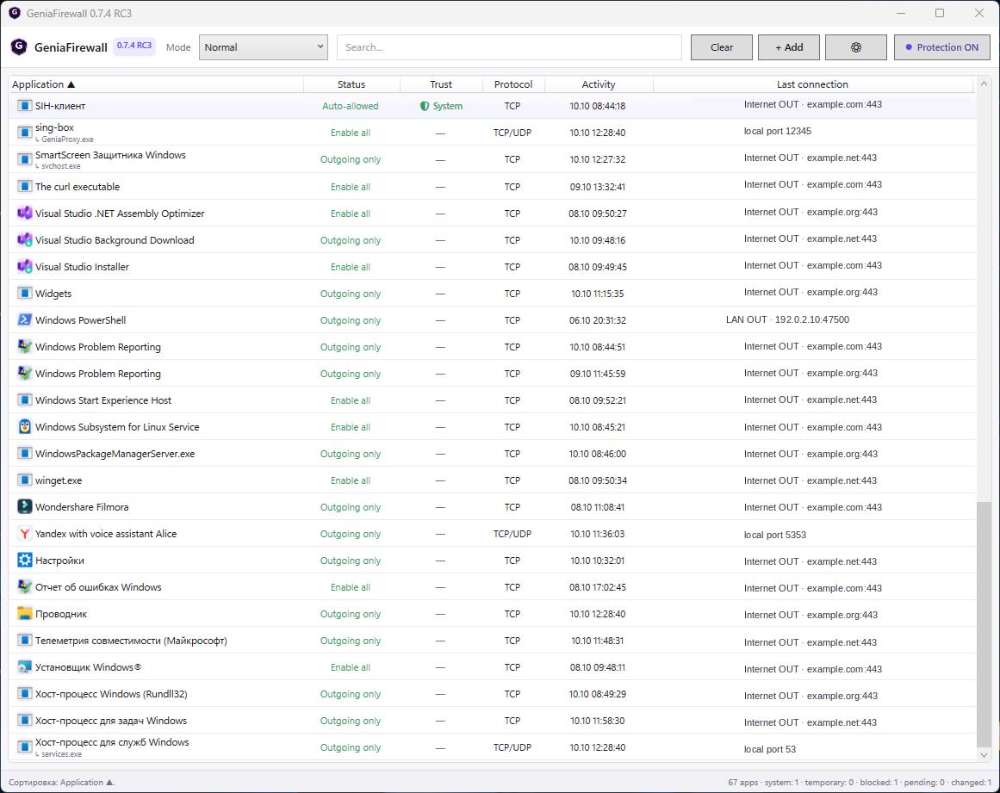

# GeniaFirewall

[English](README.md)

[](https://github.com/geniasoftwin/Genia-Firewall/actions/workflows/ci.yml)
[](https://github.com/geniasoftwin/Genia-Firewall/actions/workflows/codeql.yml)
[](LICENSE)


**Open-source application firewall для Windows с прозрачным контролем сети по приложениям.**

GeniaFirewall создан для тех, кто хочет видеть, какие программы используют сеть, и самостоятельно решать, что разрешено каждому приложению. Собственный WFP backend поддерживает входящие и исходящие правила, LAN/TUN-aware enforcement, диагностику и portable-интерфейс на WPF/.NET 10.



> **Реальный скриншот тестовой 0.7.4 RC3, не Stable 0.7.3.** Некоторые адреса и пути заменены примерами; список программ и статусы сохранены с тестового ПК. [Другие реальные скриншоты: вкладки настроек, диагностика и запрос доступа](docs/SCREENSHOTS.md).

## Зачем GeniaFirewall?

- **Правила по приложениям:** Разрешить всё, Только исходящие, Только входящие, Спрашивать или Запретить.
- **Входящий и исходящий WFP-контроль:** TCP/UDP, IPv4/IPv6.
- **Видимость LAN и Internet:** локальные и интернет-соединения без отправки телеметрии разработчику.
- **Совместимость с TUN/VPN:** app-level правила не должны зависеть от индекса физического интерфейса.
- **Глобальные режимы:** Нормальный, Мониторинг, Разрешить всё и абсолютный Блокировать всё.
- **Диагностика:** количество WFP-фильтров, состояние policy, проверка cleanup, blocked-event telemetry и состояние backend.
- **Portable-first:** пользовательские данные остаются локально. В линии 0.7.4 RC появился защищённый Single-EXE lifecycle со встроенной службой.
- **Open source:** код можно изучать, собирать, тестировать, форкать и улучшать через pull requests.

## Текущее состояние

| Канал | Состояние |
| --- | --- |
| Stable | **0.7.3** |
| Текущий development candidate | **0.7.4 RC3** в [PR #1](https://github.com/geniasoftwin/Genia-Firewall/pull/1) |
| Платформы | Windows 10/11 x64 |
| Framework | WPF / .NET 10 |
| Лицензия | GPL-3.0-only |

0.7.4 RC3 — **тестовый кандидат, не Stable**. Для Stable всё ещё требуется полный Windows validation gate и Authenticode-подпись. RC-сборки могут быть неподписанными, поэтому перед тестированием проверяйте опубликованный SHA-256.

## Firewall backends

| Возможность | GeniaFirewall WFP | Windows Firewall Compatibility |
| --- | :---: | :---: |
| Исходящие app rules | ✅ | ✅ |
| Входящие app rules | ✅ | — |
| TCP / UDP | ✅ | ✅ |
| IPv4 / IPv6 | ✅ | ✅ |
| Направленные профили | ✅ | В основном outbound |
| WFP runtime diagnostics | ✅ | — |
| Полная семантика GeniaFirewall | ✅ | Compatibility fallback |

**Важно:** Windows Firewall Compatibility намеренно ограничен по сравнению с собственным WFP backend. Для проверки настоящей inbound/outbound семантики используйте **GeniaFirewall WFP**.

## Быстрый старт

1. Откройте [Releases](https://github.com/geniasoftwin/Genia-Firewall/releases).
2. Скачайте сборку и файл SHA-256.
3. Проверьте контрольную сумму.
4. Запустите GeniaFirewall и подтвердите UAC, если требуется установка или активация службы.
5. Оставьте глобальный режим **Нормальный** и назначайте правила приложениям по мере их обнаружения.

В линии 0.7.4 RC portable-пакет содержит один пользовательский `GeniaFirewall.exe`. Встроенная привилегированная служба устанавливается в защищённый каталог и проверяется до активации WFP policy.

## Сборка из исходников

Требования:

- Windows 10 или Windows 11 x64
- .NET 10 SDK
- права администратора для тестов службы и WFP

Сборка:

```cmd
dotnet restore GeniaFirewall.sln
dotnet build GeniaFirewall.sln --configuration Release
```

Release package собирается через `publish-portable.cmd` в активной release-ветке.

## Архитектура

```text
Portable UI (WPF)
       |
       | authenticated local IPC
       v
GeniaFirewall.Service (LocalSystem)
       |
       | Windows Filtering Platform policy
       v
ALE_AUTH_CONNECT / ALE_AUTH_RECV_ACCEPT
       |
       v
TCP / UDP · IPv4 / IPv6 · Internet / LAN / TUN
```

Привилегированная служба владеет WFP policy. UI хранит пользовательские решения и локальную конфигурацию. Установка службы, ACL, IPC identity, удаление фильтров и handoff между backend рассматриваются как security boundaries.

## Тестирование — тоже вклад

Чтобы помочь проекту, **не обязательно писать код**.

Особенно полезны тесты на:

- Windows 10 и Windows 11;
- Ethernet и Wi-Fi;
- LAN client/server приложениях;
- VPN и TUN;
- смешанных IPv4/IPv6 окружениях;
- программах, которые одновременно открывают исходящие соединения и входящий listener.

См. [TESTING_RU.md](TESTING_RU.md) и [CONTRIBUTING_RU.md](CONTRIBUTING_RU.md).

## Сообщения об ошибках

Используйте шаблоны Issues. Укажите версию GeniaFirewall, версию Windows, backend, глобальный режим, профиль приложения и воспроизводимые шаги. Удаляйте из логов имена пользователей, учётные данные, личные пути и не относящиеся к ошибке IP-адреса.

Для уязвимостей **не создавайте публичный Issue**. Используйте [SECURITY.md](SECURITY.md).

## Конфиденциальность

GeniaFirewall не содержит developer analytics и не отправляет журналы автоматически. Необязательный reverse DNS использует resolver Windows. Подробнее: [PRIVACY.md](PRIVACY.md).

## Руководства

| Руководство | Для чего |
| --- | --- |
| [Установка и удаление](docs/INSTALLATION_RU.md) | **Отдельные процедуры для 0.7.3 Stable и 0.7.4 RC**, UAC и проверки |
| [Как работает WFP](docs/WFP_RU.md) | Архитектура службы и Windows Filtering Platform |
| [VPN / TUN / LAN](docs/VPN_TUN_RU.md) | Тесты, интерфейсы и ограничения |
| [Модель безопасности](docs/SECURITY_MODEL_RU.md) | Границы привилегий, cleanup, подпись |
| [FAQ](docs/FAQ_RU.md) | Частые вопросы |
| [Диагностика](docs/TROUBLESHOOTING_RU.md) | WFP BLOCK и сетевые проблемы |
| [Галерея скриншотов RC3](docs/SCREENSHOTS.md) | Реальные снимки: главное окно, 3 вкладки, запрос доступа и сведения об обезличивании |

> В галерее представлены реальные тестовые скриншоты RC3 с выборочным обезличиванием. [Отдельная концептуальная иллюстрация проекта](docs/images/geniafirewall-overview-bilingual.jpg) не является снимком интерфейса.

## Документы проекта

- [Участие в разработке](CONTRIBUTING_RU.md)
- [Руководство по тестированию](TESTING_RU.md)
- [Roadmap](ROADMAP.md)
- [Поддержка](SUPPORT.md)
- [Security policy](SECURITY.md)
- [Privacy policy](PRIVACY.md)
- [Code signing policy](CODE_SIGNING_POLICY.md)
- [Лицензионные уведомления](NOTICE.md)

## Лицензия

Исходный код GeniaFirewall распространяется по **GPL-3.0-only**. Проект можно использовать, изучать, изменять и форкать в рамках этой лицензии. Распространяемые производные работы должны соблюдать условия GPL. См. [LICENSE](LICENSE).

## Известные ограничения

- Windows 7 текущей сборкой на .NET 10 не поддерживается.
- Windows Firewall Compatibility не реализует полную inbound/outbound семантику WFP backend.
- Настоящий kernel-held pre-connect Ask пока не реализован; для него требуется WFP callout driver.
- Release Candidate — тестовая сборка, а не Stable.
