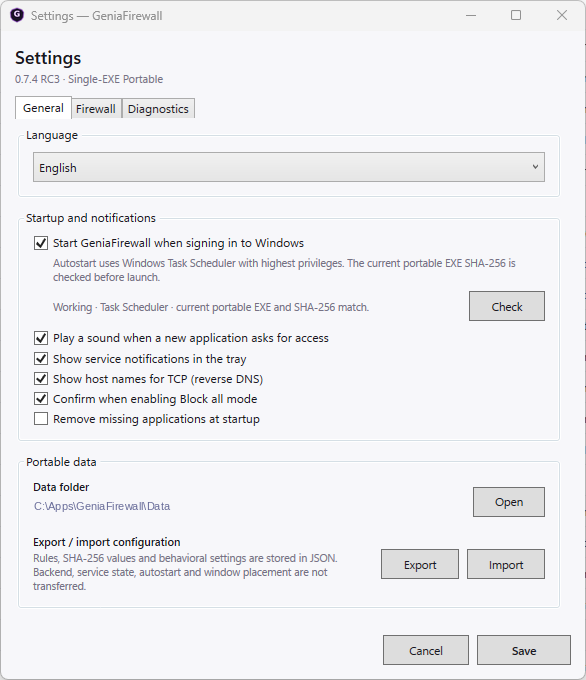
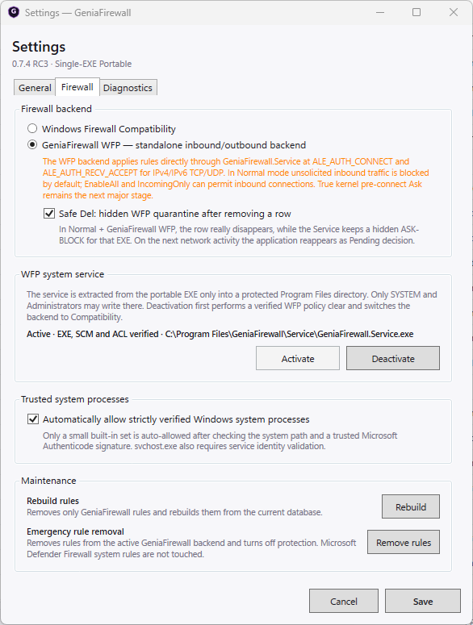
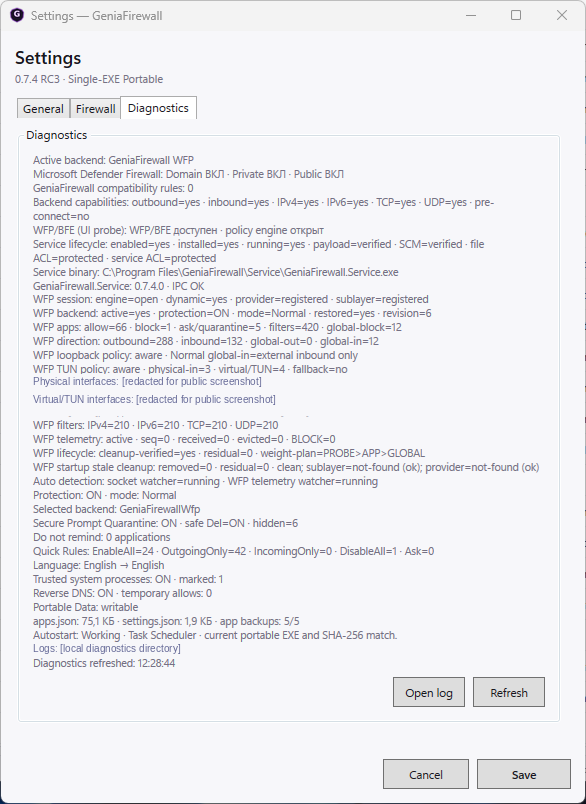
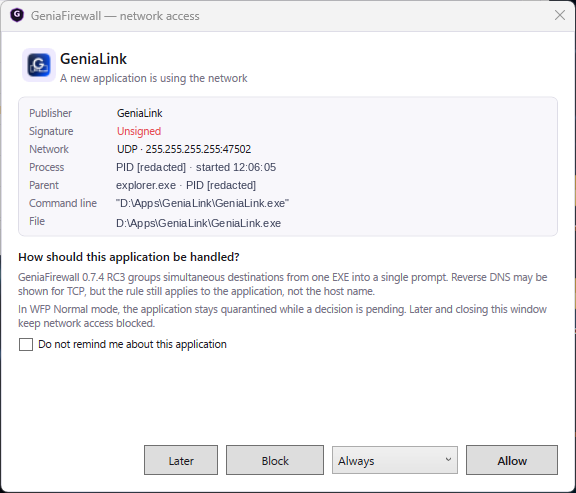

# GeniaFirewall screenshots / Скриншоты GeniaFirewall

[English README](../README.md) · [Русский README](../README_RU.md)

**Real, selectively redacted screenshots from GeniaFirewall 0.7.4 RC3 on Windows.** The screenshots show a **development/test build**, not the currently published 0.7.3 Stable. Original UI controls, layout, icons and application statuses are retained; some network endpoints, paths, interface details and process identifiers were replaced with demonstration values or removed. The application list still reflects the test machine.

**Настоящие, точечно обезличенные снимки GeniaFirewall 0.7.4 RC3 в Windows.** Это **тестовая сборка**, а не опубликованная Stable 0.7.3. Исходные элементы UI, оформление, иконки и статусы приложений сохранены; часть сетевых адресов, путей, сведений об адаптерах и идентификаторов процессов заменена демонстрационными данными или скрыта. Список программ по-прежнему отражает тестовый компьютер.

## 1. Main window / Главное окно

Application list, rule status, traffic protocol and last connection / Список программ, профили доступа, протоколы и последнее соединение.

## 2. General settings / Общие настройки

Language, Windows autostart, alerts and portable data / Язык, автозапуск Windows, уведомления и portable-данные.

[Alternative: General tab with automatic Windows language selection / Альтернативный вариант: автоопределение языка Windows](images/03-settings-general-auto.png)

## 3. Firewall settings / Настройки защиты

WFP vs Windows Firewall Compatibility, protected service, trusted processes and maintenance / Выбор backend, защищённая служба, доверенные процессы и обслуживание.

## 4. Diagnostics / Диагностика

WFP session, filter counts, service health and telemetry; interface and log paths redacted / Сессия WFP, счётчики фильтров, состояние службы и телеметрия; сведения об интерфейсах и путях обезличены.

## 5. Network access prompt / Запрос сетевого доступа

Example GeniaLink decision prompt; process identifiers and local command-line paths redacted / Пример запроса GeniaLink; идентификаторы процессов и локальные пути в аргументах скрыты или заменены.

## Image use and privacy / Использование и приватность

- These are **edited actual PNG captures**, not AI-generated replacement UIs. / Это **отредактированные реальные PNG**, а не перерисованные ИИ макеты.
- Example endpoints may use `example.com`, `example.org`, `example.net` and documentation address ranges; they are **not evidence of real traffic**. / Адреса `example.*` и тестовые IP не описывают реальные соединения.
- Do not use these images as evidence of independent security certification, a signed release, or comprehensive VPN compatibility. / Они не подтверждают сертификацию, цифровую подпись релиза или универсальную совместимость с VPN.
- The older [stylized bilingual overview](images/geniafirewall-overview-bilingual.jpg) is **illustrative**, not a screenshot of the product. / Предыдущая двуязычная иллюстрация носит **концептуальный** характер.

[Release status and testing](../TESTING.md) · [Проверка и статус](../TESTING_RU.md)
